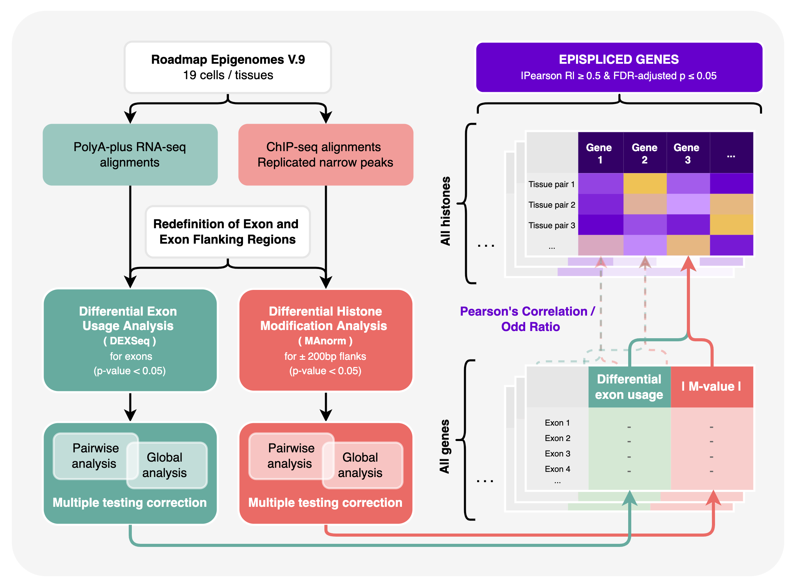

# Introduction
This repository contains the codes and materials used in the analysis of <a href="https://rdcu.be/dSe8j">our study</a> on the association between epigenetics and alternative splicing. 

# Publication & Citations
> **Link to paper**: <a href="https://rdcu.be/dSe8j">Link</a>

> **Citation**: Do, H. T. T., Shanak, S., Barghash, A., & Helms, V. (2023). Differential exon usage of developmental genes is associated with deregulated epigenetic marks. Scientific Reports, 13(1), 12256.
